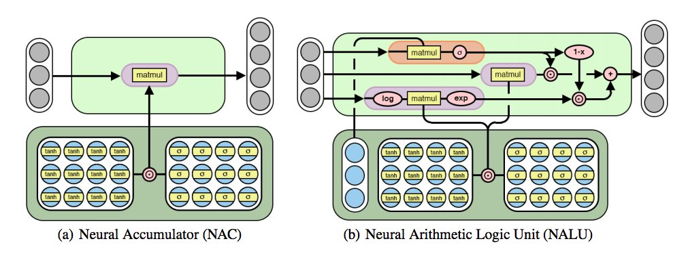

# Neural Arithmetic Logical Units
Traditionally Neural Networks, even though considered as the peak of our AI achievements, lack the credibility of counting. 
For this very purpose Google's Deep Mind released paper - [Neural Arithmetic Logical Units](https://arxiv.org/pdf/1808.00508.pdf). 
An NALU is a combination of two Neural Accumulators (NACs) with a sigmoidal gate. The NAC is inherently good in accumulation process, 
example addition subtraction. The NALU, as name suggests, is an arithmetic and Logical unit. So it can perform any computable operations (even counting).

## Structure of NALU
||
|:--------------------------------:|
|Structure of NAC and NALU|

